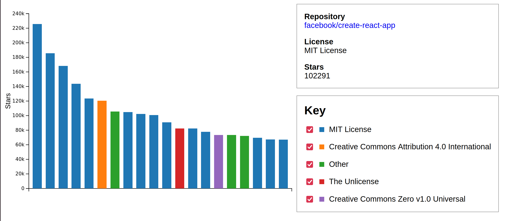
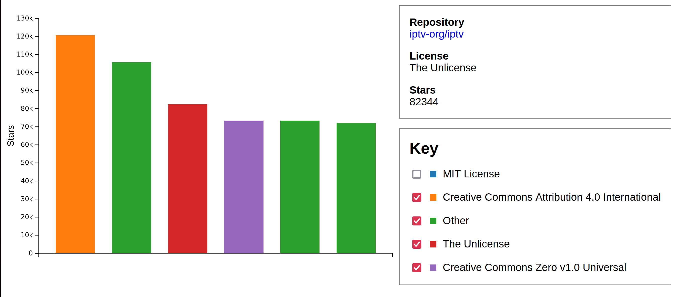

# GitHub_API_DataChart
An interactive chart using Javasctipt Library D3 to gather live data from GitHub Search API.

## Purpose
 Using live data gathered from GitHub Search API,this D3 custom chart allows users to filter through the most popular GitHub API's as well as providing the URL to their respective repositories.

   

 
  

  

## 🔧 Requeriments
- Any web browser.

### Cloning the Repository

$ git clone https://github.com/numa-501st/GitHub_API_DataChart.git
    

 
  

    
_This web app was was created by the guide of "JavaScript Crash Course" Book by Nick Morgan._
